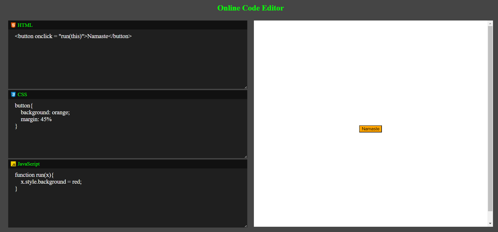

# CodePencil ✒️
 
CodePencil is a basic Online Code Editor that lets you write and preview HTML, CSS, and JavaScript code in real-time. 

## Usage

- **HTML Input**: Write your HTML code in the `HTML` textarea. As you type or make changes, the preview will update automatically to reflect the changes.

- **CSS Input**: Add your CSS code in the `CSS` textarea. Like the HTML input, the styles will be applied to the content in real-time.

- **JavaScript Input**: Write your JavaScript code in the `JavaScript` textarea. This code will be executed when you press any keys inside this textarea or make changes.

- **Preview**: The output of your code will be displayed on the right side of the editor.

## Snap

## Demo

Try [CodePencil](https://alokverma18.github.io/CodePencil/) 

## Contributing
Feel free to Contribute and Improve this GPA Calculator by creating a Pull Request or an Issue.

## Connect 

## 
### Leave a 🌟 if it was Helpful!!
### Thanks!
